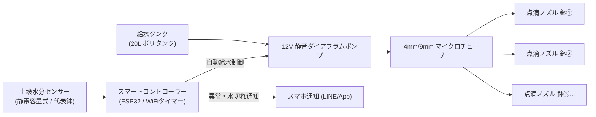

# 🌿 Vegetable Garden Project (スマート週末家庭菜園)

自宅前の限られたスペースで、平日は「手間いらず・枯らさない安心」、週末は「2人で楽しむリフレッシュと旬の味覚」を実現する、スマート家庭菜園プロジェクトです。

---

## 🎯 プロジェクト概要 & ペルソナ

* **ターゲットペルソナ**: 
  * 会社員と主婦の2人家族
  * スタイル: 週末農家（作業時間は土日の数時間程度）
  * 目的: 季節の旬の野菜を育て、楽をしつつ収穫の喜びと採れたての食卓を楽しむ
* **栽培環境**:
  * 設置場所: 自宅前 約2畳スペース（約 1.8m × 1.8m）
  * 容器: 7ガロン（約26〜30L）不織布プランター × 6個
* **コアコンセプト**:
  * **平日（月〜金）**: 完全自動給水と見守りにより「ノーメンテ・ゼロプレッシャー」
  * **週末（土・日）**: 迷わず作業できるToDoガイドと、2人で楽しむ収穫＆旬の食卓

---

## 🪴 6鉢の作付けポートフォリオ（2人分食べきり・旬リレー）

7ガロン不織布プランター（高通気・根張り良好）の容量を活かした6鉢の構成案です。

```
【 2畳スペース（約180cm × 180cm）レイアウト 】

 ┌────────────────────────────────────────┐
 │  [鉢①: メイン]   [鉢②: メイン]   [鉢③: メイン]  │ ← 奥側（日当たりの良い場所）
 │   (トマト等)       (ナス等)        (キュウリ等)   │
 │                                        │
 │  ───────────────────────────────────── │
 │           【作業・収穫スペース】         │ ← 幅約60〜70cmの通路
 │        (2人で並んで作業できる動線)       │
 │  ───────────────────────────────────── │
 │                                        │
 │  [鉢④: おつまみ] [鉢⑤: 葉物/サラダ] [鉢⑥: 薬味/ハーブ]│
 │   (枝豆/豆類)     (レタス/小松菜)     (大葉/バジル) │
 │                                        │
 │  [給水タンク & コントローラーBOX] (隅に配置)    │
 └────────────────────────────────────────┘
```

| 鉢番号 | 役割・テーマ | 春夏（4月〜8月） | 秋冬（9月〜2月） | 期待する体験価値 |
| :--- | :--- | :--- | :--- | :--- |
| **鉢①** | 旬の主役 A | ミニトマト（アイコ等） | キャベツ・ブロッコリー | 週末のまとまった収穫と成長の実感 |
| **鉢②** | 旬の主役 B | ナス / ピーマン | ミニ大根・カブ | 煮物・炒め物に使う旬の味覚 |
| **鉢③** | つる性・立体 | キュウリ / ゴーヤ | スナップエンドウ | 縦空間活用・みずみずしい採れたて感 |
| **鉢④** | 週末晩酌・イベント | 枝豆（ビールのお供） | イチゴ（デザート） | 週末の2人飲み・ご褒美スイーツ |
| **鉢⑤** | 高速サラダリレー | サニーレタス / ベビーリーフ | ホウレンソウ / 小松菜 | 朝食や夕食に「外葉からちぎって収穫」 |
| **鉢⑥** | デイリー薬味・ハーブ | 大葉 / バジル / パセリ寄せ植え | 小ネギ / ルッコラ | 平日の料理に「ちょっと足す」便利さ |

---

## ⚡ 自動化（IoT・ハードウェア）アーキテクチャ

不織布プランターの「乾きやすさ」をカバーし、生活空間に溶け込むスッキリした給水システム。



* **点滴灌水**: 各プランターの根元にポタポタと給水（水跳ね・泥汚れ防止）。
* **生活調和・美観**: 配線の隠蔽、各鉢の下にキャスター付き台座やすのこ＋トレイを設置して地面の汚れを防止。

---

## 👥 プロジェクトチーム役割定義（AI協調体制）

| ロール | 主な担当領域 |
| :--- | :--- |
| **週末UX・ToDoナビゲーター** | 週末の作業指示（迷わないToDo）、平日完全放置のオペレーション設計 |
| **旬の作付け＆食卓プランナー** | 2人分ジャストサイズの品種選定、採れたて野菜の週末ペアレシピ提案 |
| **平日おまかせハードエンジニア** | 給水ポンプ・配管・センサー・ESP32回路設計・防水ケース選定 |
| **ガーデン対話コンパニオン** | 葉の写真による病気診断、栽培記録、LINE/Web通知ボット |

---

## 📂 ディレクトリ構成（予定）

```
vegetable-garden/
├── docs/                 # 詳細ドキュメント
│   ├── planning/         # 作付け・栽培計画・カレンダー
│   ├── hardware/         # 回路図・配管設計・部品表(BOM)
│   ├── software/         # アプリ・ファームウェア仕様書
│   └── recipes/          # 収穫野菜のペアレシピ集
├── hardware/             # ハードウェア関連データ（3Dケース・配線図等）
├── firmware/             # マイコン制御コード（ESP32/Arduino）
└── README.md             # プロジェクト概要（本ファイル）
```
